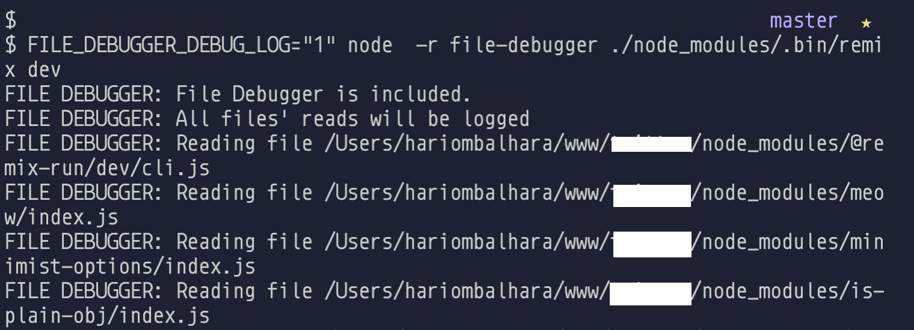
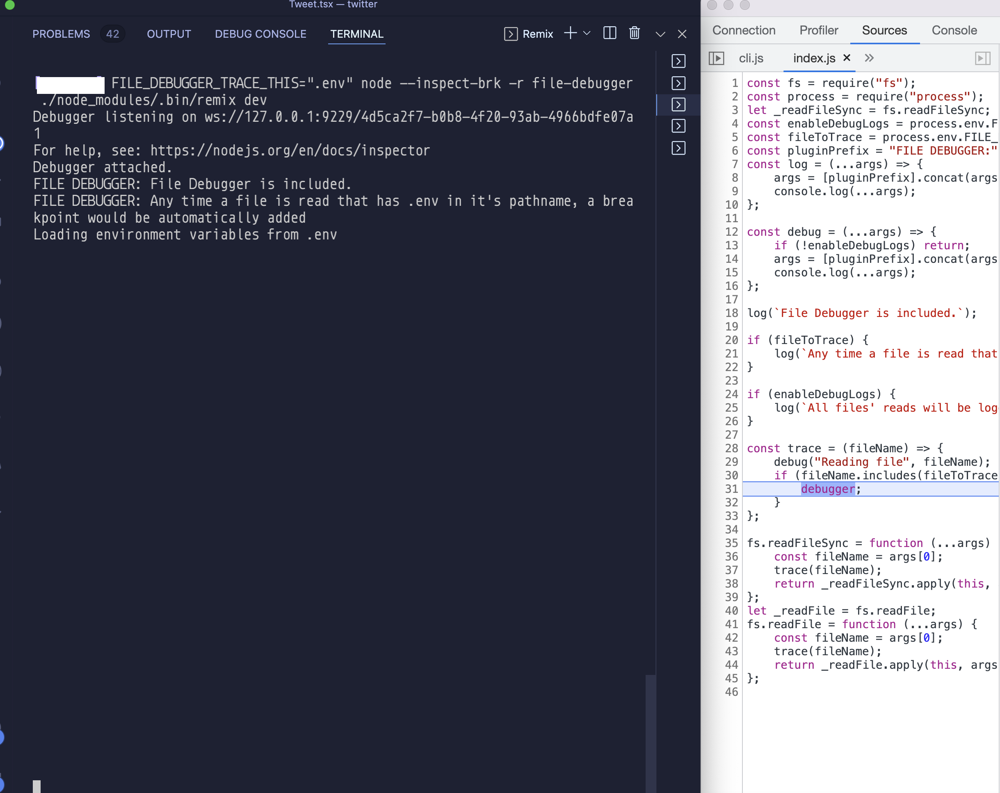

# File Debugger

## Introduction

Debugs files being accessed by any NodeJS dependency.

- Adds automatic breakpoint at the line where the file is being read
- Logs all the files that are being read

## Motivation

- Sometimes you add/change something in a config file and expect an npm dependency to act on it, but what if it does't work. How do you know where, how and in which condition that dependency accesses that file.

## Usage

Global Installation - Recommended, so that you install it once and can use it in all your projects
`npm i file-debugger -g`

Run script with a require of `file-debugger`

`node -r file-debugger your_file_with_hundreds_of_deps.js`

Optionally you can install locally but you would have to repeat it for every project

`npm i file-debugger --save-dev`

### Configuration using environment variables

Enable Logging using `FILE_DEBUGGER_DEBUG_LOG="1"`

Enable automatic debugger using `FILE_DEBUGGER_TRACE_THIS="SUBSTRING_MATCHING_FILE_PATH_NAME"`
